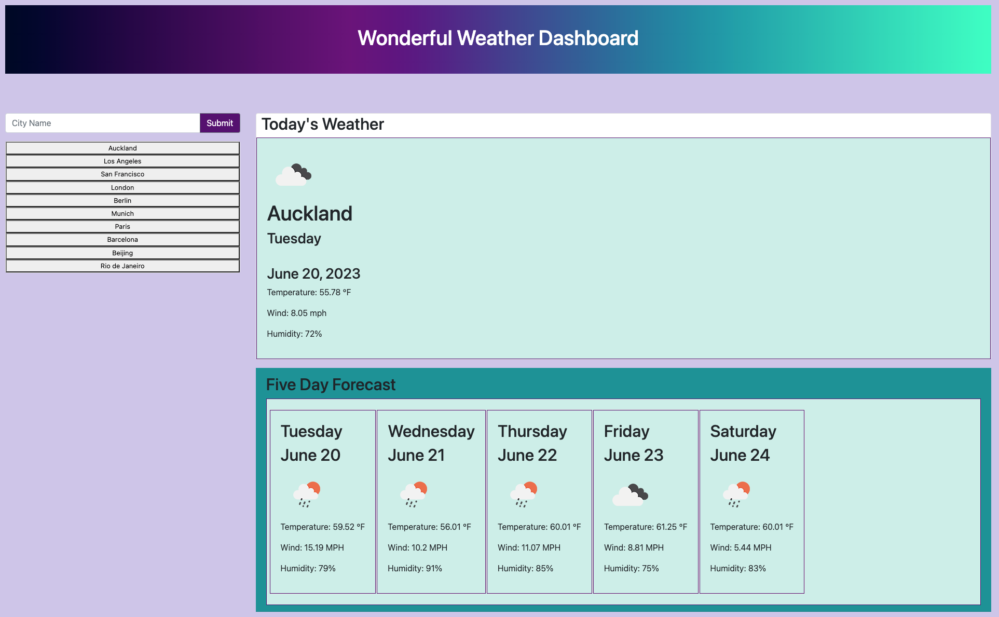

# Wonderful Weather Dashboard

This project is a weather dashboard application that allows users to search for a city and view the current weather conditions as well as the 5-day forecast for that city. The application is built using HTML, CSS, and JavaScript.

## Technologies Used

- HTML
- JavaScript
- CSS
- Bootstrap

## Features

- City Search: Users can search for a city using the input field provided.
- Current Weather: The application displays the current weather conditions for the searched city, including the city name, date, weather condition icon, temperature, humidity, and wind speed.
- 5-Day Forecast: The application provides a 5-day forecast for the searched city, displaying the date, weather condition icon, temperature, humidity, and wind speed for each day.
- Search History: The application keeps track of the user's search history and displays past searched cities as buttons. Clicking on a past city button retrieves and displays the current and future weather conditions for that city.
- Responsive Design: The application is designed to be responsive and can adapt to different screen sizes, making it accessible on various devices.

## Getting Started

To run this project locally, follow these steps:

1. Clone the repository: `git clone <https://github.com/your-username/weather-dashboard.git>`
2. Navigate to the project directory: `weather-dashboard`
3. Open the `index.html` file in a web browser.

## Usage

1. Open the weather dashboard application in a web browser.
2. Enter a city name in the search input field and click the search button or press Enter.
3. The current weather conditions and the 5-day forecast for the entered city will be displayed.
4. To view the current and future weather for a past searched city, click on the respective city button in the search history.
5. Repeat the above steps to search for weather conditions of different cities.

## Screenshots

## Credits

This project was developed by Donahi Casas-Silva. It was created as part of the UC Berkeley Extension Coding Bootcamp curriculum and is based on the requirements in the instructional materials.

### Instructors/Tutors/Collaborators:

This project was created with help from the following people and resources:

Monique Merzoug as my study partner, and the
UC Berkeley Extension Bootcamp course instructor, Teaching Assistants and Zoom video tutors who provided guidance and assistance.
